# Auditoría Técnica — SupplyFlow / RestoSupply

> Auditoría de solo lectura realizada sobre el estado del repositorio en la rama `main`.
> Cada hallazgo cita archivo y línea. Alcance: `server.ts`, `src/**`, configuración de build y despliegue.

---

## 1. Resumen ejecutivo

SupplyFlow es un MVP funcional y visualmente pulido: el flujo cocinero→comprador→entrega está bien modelado, la sincronización en tiempo real con SSE funciona, y la UX mobile-first (modo compra, checklist <60s, i18n, temas) está por encima del promedio para un proyecto de este tamaño. **Sin embargo, no es desplegable a producción en su estado actual.** El backend (`server.ts`) es un prototipo en memoria sin persistencia, sin autenticación y sin validación de entradas.

Los **3 riesgos más urgentes**:

1. **Pérdida total de datos en cada reinicio.** Todo el estado vive en variables en memoria ([`server.ts:26-108`](server.ts)). Un reinicio, deploy o crash borra restaurantes, productos, solicitudes y auditorías.
2. **Cero autenticación/autorización en la API.** Cualquiera con la URL puede leer y mutar todo. La identidad del usuario la envía el cliente ([`server.ts:221`](server.ts), [`App.tsx:51`](src/App.tsx)) y el control de acceso por rol es solo visual, no del servidor.
3. **Sin validación de entradas en el backend.** Los cuerpos se propagan crudos (`...req.body`) y `POST /api/checklist` revienta con un 500 si falta `stockReadings` ([`server.ts:391`](server.ts)).

Estado general: **Prototipo/Demo sólido (frontend maduro, backend de juguete).** Recomendación: no exponer públicamente hasta resolver persistencia, auth y validación.

---

## 2. Arquitectura actual

Servidor único Express que hace de API REST + stream SSE + middleware de Vite (dev) o estáticos (prod). El estado es global en memoria. **No hay base de datos y, pese a la configuración, no hay integración con Gemini.**

```mermaid
flowchart TB
  subgraph Cliente["Navegador (React 19 + Vite)"]
    UI["Componentes UI<br/>(App.tsx, RequestsList, ShoppingMode...)"]
    API["src/lib/api.ts<br/>(fetch a /api/*)"]
    ES["EventSource /api/stream<br/>(App.tsx:118)"]
    CU["currentUser (estado local)<br/>identidad elegida en cliente"]
    UI --> API
    UI <--> CU
  end

  subgraph Servidor["server.ts (Express único · puerto 3000 · 0.0.0.0)"]
    REST["Endpoints REST<br/>/restaurants /products /requests<br/>/checklist /analytics /notifications"]
    MEM[("Estado EN MEMORIA<br/>restaurants, users, products,<br/>supplyRequests, auditLogs<br/>(server.ts:26-108)")]
    SSE["broadcastUpdate()<br/>push a todos los sseClients<br/>(server.ts:113-116)"]
    VITE["Vite middleware (dev)<br/>express.static (prod)"]
    REST --> MEM
    REST --> SSE
  end

  subgraph Externos["Dependencias externas"]
    GENAI["@google/genai<br/>INSTALADO PERO NUNCA IMPORTADO"]
    UNSPLASH["images.unsplash.com<br/>(avatares)"]
    WA["wa.me (WhatsApp links)"]
  end

  API -->|"HTTP JSON"| REST
  ES -->|"SSE (text/event-stream)"| SSE
  SSE -.->|"broadcast global"| ES
  UI -.->|"img src"| UNSPLASH
  UI -.->|"click-to-chat"| WA
  MEM -. "sin persistencia:<br/>se pierde al reiniciar" .-> MEM
  Servidor -. "metadata.json declara<br/>SERVER_SIDE_GEMINI_API<br/>pero no hay código" .-> GENAI

  style MEM fill:#7f1d1d,color:#fff
  style GENAI fill:#78350f,color:#fff
  style CU fill:#78350f,color:#fff
```



**Flujo de datos típico (checklist → solicitud):** el cocinero registra stock → `POST /api/checklist` ([`server.ts:382`](server.ts)) compara contra `minThreshold`, escribe en memoria, genera `SupplyRequest` y hace `broadcastUpdate('REQUEST_CREATED')` → todos los `EventSource` conectados reciben el objeto completo → el comprador lo ve en tiempo real.

---

## 3. Fortalezas (con evidencia)

- **F1 — Modelo de dominio tipado y coherente.** `src/types.ts` define bien el ciclo de vida (`RequestStatus`, `RequestItem`, `SupplyRequest`) y se reutiliza en cliente y servidor. Es la base más sólida del proyecto ([`types.ts:30-119`](src/types.ts)).
- **F2 — Máquina de estados de compra bien pensada.** La transición y, sobre todo, el *split* automático de ítems no comprados en una nueva solicitud pendiente es lógica de negocio real y correcta ([`server.ts:305-346`](server.ts)).
- **F3 — Tiempo real funcional con SSE.** Implementación limpia de servidor→cliente con limpieza de conexión en `close` ([`server.ts:118-129`](server.ts), [`App.tsx:118-152`](src/App.tsx)).
- **F4 — UX/mobile-first de alta calidad.** Modo compra agrupado por proveedor con barra de progreso ([`ShoppingModeModal.tsx:45-58`](src/components/ShoppingModeModal.tsx)), checklist con presets rápidos ([`DailyChecklist.tsx:120-131`](src/components/DailyChecklist.tsx)) y navegación por rol ([`App.tsx:371-390`](src/App.tsx)).
- **F5 — Degradación defensiva en el cliente.** `api.ts` envuelve los `fetch` en try/catch y evita que un fallo de red rompa la app ([`api.ts:5-14`](src/lib/api.ts)).
- **F6 — i18n y theming presentes desde el diseño.** `translations.ts` y el toggle de tema sincronizado con la raíz del DOM ([`App.tsx:360-368`](src/App.tsx)).
- **F7 — Secretos correctamente ignorados en git.** `.gitignore` excluye `.env*` salvo `.env.example` ([`.gitignore`](.gitignore)). No hay claves hardcodeadas en el código.

---

## 4. Debilidades críticas y de seguridad (ordenadas por severidad)

### 🔴 CRÍTICA

**D1 — Estado 100% en memoria: pérdida de datos garantizada.**
`restaurants`, `users`, `products`, `supplyRequests`, `auditLogs` son arrays mutables en el proceso ([`server.ts:26-108`](server.ts)). Cualquier reinicio (deploy, crash, escalado, `NODE_ENV` cambio) vacía la base. Además impide correr más de una instancia (cada réplica tendría su propio estado divergente).
- Esfuerzo: **Alto** · Riesgo si no se corrige: *un restaurante pierde su historial de compras y catálogo en el primer reinicio del servidor.*

**D2 — API sin autenticación ni autorización.**
Ningún endpoint valida identidad. La "identidad" (`createdByUserId`, `buyerId`) llega en el body y el servidor confía ciegamente ([`server.ts:221`](server.ts), [`server.ts:259`](server.ts)). El `currentUser` se elige en un dropdown del cliente ([`App.tsx:51`](src/App.tsx), [`Header.tsx:220-262`](src/components/Header.tsx)). El control de acceso al "Modo Compra" es puramente visual ([`App.tsx:216-238`](src/App.tsx)); el servidor no lo replica.
- Esfuerzo: **Alto** · Riesgo si no se corrige: *cualquiera con la URL lee todos los pedidos y muta/borra el catálogo; un comprador puede suplantar a otro enviando su `buyerId`.*

**D3 — Sin validación de entradas en el backend (incluye crash explotable).**
`POST /api/checklist` hace `Object.entries(stockReadings)` sin comprobar que exista → **500 no controlado** si el campo falta o no es objeto ([`server.ts:391`](server.ts)). `POST /api/products` y `PUT /api/products/:id` propagan `...req.body` sin esquema, permitiendo inyectar campos arbitrarios o romper invariantes de tipo ([`server.ts:173-181`](server.ts), [`server.ts:189-193`](server.ts)).
- Esfuerzo: **Medio** · Riesgo si no se corrige: *un cliente malformado tumba el endpoint principal del flujo o corrompe registros con campos no válidos.*

### 🟠 ALTA

**D4 — Generación de IDs por longitud de array → colisiones y corrupción.**
`rest-${restaurants.length + 1}` y `prod-${products.length + 1}` ([`server.ts:145`](server.ts), [`server.ts:175`](server.ts)). Tras borrar un producto y crear otro, el nuevo reutiliza un ID existente → llaves duplicadas de React, updates que afectan al registro equivocado y `DELETE` que borra de más.
- Esfuerzo: **Bajo** · Riesgo si no se corrige: *editar el producto A modifica el B; borrar uno elimina dos.*

**D5 — Endpoints de estado sin guardas de transición → secuestro de solicitudes.**
`PUT /api/requests/:id/claim` no verifica que la solicitud esté `Pendiente` ni que no tenga ya comprador ([`server.ts:257-273`](server.ts)); sobrescribe `assignedBuyerId` sin condición. La UI lo evita, pero la API no.
- Esfuerzo: **Bajo** · Riesgo si no se corrige: *un comprador roba una solicitud ya asignada llamando directo a la API.*

**D6 — SSE difunde objetos completos a todos los clientes, sin filtrado ni heartbeat.**
`broadcastUpdate` envía cada cambio a *todos* los `sseClients` sin filtrar por restaurante ni rol ([`server.ts:113-116`](server.ts)). Un usuario del restaurante 1 recibe en claro las solicitudes del restaurante 4. Además no hay keep-alive/ping: proxies y balanceadores cortan conexiones ociosas, y no hay límite de conexiones (posible fuga de memoria).
- Esfuerzo: **Medio** · Riesgo si no se corrige: *sobre-exposición de datos entre locales y caídas silenciosas del "tiempo real" detrás de un proxy.*

**D7 — PWA incompleta: no es instalable ni offline.**
El `manifest.json` referencia `/pwa-icon.png` y `showLocalNotification` usa el mismo icono ([`manifest.json:13`](public/manifest.json), [`notifications.ts:97-98`](src/lib/notifications.ts)), pero **ese archivo no existe** (en `public/` solo hay `manifest.json`). **No hay service worker** registrado en ninguna parte del código. Chrome solo dispara `beforeinstallprompt` con un SW con handler `fetch`, así que el botón "Instalar Directamente" ([`PWAInstallPrompt.tsx:53-59`](src/components/PWAInstallPrompt.tsx), que depende de `deferredPrompt` en [`App.tsx:159-162`](src/App.tsx)) prácticamente nunca se activará en Android/desktop.
- Esfuerzo: **Medio** · Riesgo si no se corrige: *la promesa central de "app instalable/offline" no se cumple; el icono roto degrada notificaciones e instalación.*

**D8 — Dependencia y capacidad de Gemini declaradas pero inexistentes.**
`@google/genai` está en `dependencies` ([`package.json:15`](package.json)) y presente en el lockfile, pero **no se importa en ningún archivo** (`grep` de `genai`/`GoogleGenAI` en `src` y `server.ts` = 0). `metadata.json` declara `MAJOR_CAPABILITY_SERVER_SIDE_GEMINI_API` ([`metadata.json:5`](metadata.json)) y `.env.example` exige `GEMINI_API_KEY` ([`.env.example:4`](.env.example)). Configuración y expectativa sin implementación.
- Esfuerzo: **Bajo** · Riesgo si no se corrige: *dependencia muerta (peso, superficie de ataque, alertas de seguridad) y documentación/capacidad engañosa para quien despliegue.*

---

## 5. Deuda técnica y oportunidades de mejora (ordenadas por severidad)

### 🟠 ALTA

**O1 — TypeScript sin `strict` y `any` generalizado.**
`tsconfig.json` no activa `strict` ni `noImplicitAny` ([`tsconfig.json:2-25`](tsconfig.json)). Se pierde el mayor valor de TS. Ejemplos: `broadcastUpdate(type: string, data: any)` ([`server.ts:113`](server.ts)), `data: any` en el dashboard ([`AnalyticsDashboard.tsx:15`](src/components/AnalyticsDashboard.tsx)), `deferredPrompt` tipado `any` ([`App.tsx:71`](src/App.tsx)) y múltiples `as any` en formularios de `AdminCatalog`.
- Esfuerzo: **Medio** · Riesgo: *bugs de tipo que hoy no se detectan en compilación llegan a runtime.*

**O2 — Ausencia total de tests.**
No hay archivos de test ni runner en `package.json`. El único "lint" es `tsc --noEmit` ([`package.json:12`](package.json)). Lógica crítica como el split de solicitudes ([`server.ts:305-346`](server.ts)) no tiene red de seguridad.
- Esfuerzo: **Alto** · Riesgo: *cualquier refactor del flujo de compra puede romper reglas de negocio sin aviso.*

### 🟡 MEDIA

**O3 — Closures obsoletas en el handler SSE.**
El `useEffect` del stream depende solo de `[loadInitialData]` pero su `onmessage` captura `shoppingModalRequest` ([`App.tsx:114-167`](src/App.tsx)); ese valor queda congelado al montar, así que la sincronización en vivo del modal de compra no refleja updates externos de forma fiable.
- Esfuerzo: **Medio** · Riesgo: *el modal de compra muestra datos desactualizados cuando otro usuario modifica la misma solicitud.*

**O4 — Errores tragados en silencio en la capa de API.**
`fetchUsers`, `fetchProducts`, etc. devuelven `[]` ante cualquier error ([`api.ts:16-37`](src/lib/api.ts)) y el `loadInitialData` solo asigna `if (length > 0)` ([`App.tsx:102-111`](src/App.tsx)). Un backend caído se ve como "todo vacío" sin feedback, y una lista que queda en 0 tras borrados no se refleja.
- Esfuerzo: **Bajo** · Riesgo: *fallos de red indistinguibles de "no hay datos"; UX confusa.*

**O5 — Acoplamiento e inconsistencia en la capa de datos.**
`handleAddRestaurant` hace `fetch` directo saltándose `api.ts` ([`App.tsx:326-335`](src/App.tsx)), mientras el resto pasa por la capa. No hay `createRestaurant` en `api.ts`. Rompe la única abstracción de acceso a datos.
- Esfuerzo: **Bajo** · Riesgo: *mantenimiento disperso; el día que cambie el contrato de la API hay que tocar dos lugares.*

**O6 — Hardening de producción ausente.**
Servidor escucha en `0.0.0.0` ([`server.ts:526`](server.ts)) sin `helmet`, sin rate limiting, sin límite de body explícito, sin CORS configurado y sin manejo de 404 para rutas `/api` desconocidas. La rama `NODE_ENV !== 'production'` monta Vite en dev ([`server.ts:512-524`](server.ts)); correcta, pero el modo prod sirve estáticos sin cabeceras de seguridad ni compresión.
- Esfuerzo: **Medio** · Riesgo: *superficie de ataque innecesaria y ausencia de límites básicos anti-abuso.*

**O7 — Higiene de `package.json`.**
`vite` está duplicado en `dependencies` y `devDependencies` ([`package.json:21`](package.json) y [`package.json:33`](package.json)); nombre genérico `"react-example"` y `version: 0.0.0`; el script `clean` usa `rm -rf` (no portable a `cmd`/PowerShell en Windows, el entorno declarado) ([`package.json:11`](package.json)).
- Esfuerzo: **Bajo** · Riesgo: *builds y limpieza inconsistentes entre entornos.*

### 🟢 BAJA

**O8 — i18n incompleta.** `translations.ts` cubre header/nav/ajustes, pero la mayoría de los componentes tienen texto en español hardcodeado (p. ej. `RequestsList.tsx`, `ShoppingModeModal.tsx`, `AnalyticsDashboard.tsx`). Cambiar a inglés deja el 80% de la UI en español. Esfuerzo: **Alto** · Riesgo: *la opción de idioma promete algo que no cumple.*

**O9 — Dependencias externas en el render.** Avatares desde `images.unsplash.com` ([`caddyShackData.ts:49`](src/data/caddyShackData.ts), [`ProfileSettingsModal.tsx:26-42`](src/components/ProfileSettingsModal.tsx)); si Unsplash cae o cambia, se rompen las fotos. `motion` está en dependencias pero no se usa. Esfuerzo: **Bajo**.

**O10 — Datos semilla con PII de muestra en repo público.** Nombres, teléfonos y direcciones de locales/usuarios en `caddyShackData.ts` (repo `github.com/yacielmendoza/supplyflow`). Son teléfonos ficticios `555`, riesgo bajo, pero conviene marcarlos claramente como demo. Esfuerzo: **Bajo**.

**O11 — Bordes numéricos.** `progressPct = purchasedCount / totalItems` da `NaN` si una solicitud llegara con 0 ítems ([`ShoppingModeModal.tsx:58`](src/components/ShoppingModeModal.tsx)); hoy no ocurre pero no está guardado. Esfuerzo: **Bajo**.

---

## 6. Tabla priorizada de acciones recomendadas

| # | Acción | Severidad | Esfuerzo | Archivo(s) afectado(s) |
|---|--------|-----------|----------|------------------------|
| D1 | Añadir persistencia real (Postgres/SQLite + capa de repositorio) reemplazando el estado en memoria | 🔴 Crítica | Alto | `server.ts:26-108` |
| D2 | Introducir autenticación y autorización server-side por rol; dejar de confiar en IDs del cliente | 🔴 Crítica | Alto | `server.ts` (todos), `src/App.tsx:51`, `src/lib/api.ts` |
| D3 | Validar todos los cuerpos de entrada (p. ej. Zod) y blindar `stockReadings` | 🔴 Crítica | Medio | `server.ts:172-193`, `server.ts:382-391` |
| D4 | Generar IDs con `crypto.randomUUID()` en vez de `array.length + 1` | 🟠 Alta | Bajo | `server.ts:145`, `server.ts:175` |
| D5 | Añadir guardas de transición de estado en `claim`/`status` | 🟠 Alta | Bajo | `server.ts:257-350` |
| D6 | Filtrar SSE por restaurante/rol y agregar heartbeat + límite de conexiones | 🟠 Alta | Medio | `server.ts:111-129` |
| D7 | Completar PWA: añadir `pwa-icon.png` y registrar un service worker (offline + instalación) | 🟠 Alta | Medio | `public/`, `index.html`, `manifest.json`, `App.tsx:159-162` |
| D8 | Implementar Gemini o eliminar dependencia + capacidad declarada | 🟠 Alta | Bajo | `package.json:15`, `metadata.json:5`, `.env.example` |
| O1 | Activar `strict` en TS y erradicar `any` | 🟠 Alta | Medio | `tsconfig.json`, `server.ts:113`, varios componentes |
| O2 | Introducir suite de tests (Vitest) sobre lógica de negocio | 🟠 Alta | Alto | (nuevo) + `server.ts:305-346` |
| O3 | Corregir closures obsoletas del handler SSE | 🟡 Media | Medio | `src/App.tsx:114-167` |
| O4 | Diferenciar error de red vs. lista vacía; dar feedback | 🟡 Media | Bajo | `src/lib/api.ts`, `src/App.tsx:94-112` |
| O5 | Unificar acceso a datos en `api.ts` (`createRestaurant`) | 🟡 Media | Bajo | `src/App.tsx:326-335`, `src/lib/api.ts` |
| O6 | Hardening prod: helmet, rate limit, body limit, CORS, 404 API | 🟡 Media | Medio | `server.ts:510-529` |
| O7 | Limpiar `package.json` (vite duplicado, nombre, script clean) | 🟡 Media | Bajo | `package.json` |
| O8 | Completar i18n en todos los componentes | 🟢 Baja | Alto | `src/components/**`, `src/lib/translations.ts` |
| O9 | Autoalojar avatares; eliminar `motion` no usado | 🟢 Baja | Bajo | `caddyShackData.ts`, `ProfileSettingsModal.tsx`, `package.json` |
| O10 | Marcar/segregar datos demo con PII | 🟢 Baja | Bajo | `src/data/caddyShackData.ts` |
| O11 | Guardar división por cero en progreso | 🟢 Baja | Bajo | `ShoppingModeModal.tsx:58` |

---

## 7. Preguntas abiertas / decisiones de producto

1. **¿Gemini es parte del roadmap o un residuo del andamiaje de AI Studio?** De ello depende si D8 es "implementar" o "eliminar". Hoy no existe ninguna llamada a IA (¿sugerencia de cantidades, predicción de consumo, parsing de facturas…?).
2. **Modelo de identidad y multi-tenant:** ¿un login por persona con roles reales, o un dispositivo compartido por local donde se cambia de usuario? Define la estrategia de auth de D2 (sesiones vs. tokens vs. PIN por dispositivo).
3. **Persistencia:** ¿destino de despliegue (Cloud Run según `.env.example`/metadata)? ¿Preferencia de BD gestionada (Postgres/Supabase) o algo embebido? Condiciona D1.
4. **Alcance real de "tiempo real":** ¿los compradores deben ver pedidos de todos los locales o solo los asignados? Define el filtrado de D6.
5. **Offline-first:** ¿es requisito operar sin señal dentro de una tienda/food-truck? Si sí, D7 sube de prioridad y hay que diseñar sincronización de cambios locales.
6. **Notificaciones push reales:** hoy son locales del navegador + SSE. ¿Se requiere push nativo (Web Push/FCM) para alertar con la app cerrada? Es la diferencia entre "demo de notificación" y utilidad operativa.
```
